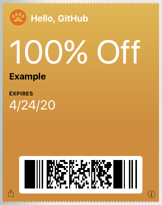

# pkpass-go

## Summary
This package will generate a signed Apple Wallet Pass given your companion files, and your Apple issued Pass Type Certificate.

For instructions on how to obtain these certifcates for your account, [please see this tutorial](https://developer.apple.com/library/archive/documentation/UserExperience/Conceptual/PassKit_PG/YourFirst.html).



## Usage
```go
// Open your certifcate via a file, string reader, etc.
cert, err := os.Open("Certificates.p12")
if err != nil {
    panic(err)
}
defer cert.Close()
    
// Pass the directory containing your companiion files, the password you need
// to open your certificate, and the actual certificate to the New func.
r, err := pkpass.New("Coupon.pass", "", cert)
if err != nil {
    panic(err)
}

// The reader contains your freshly minted .pkpass file, just write it out so you can
// use it.
f, err := os.Create("Coupon.pkpass")
if err != nil {
    t.Fatal(err)
}
defer f.Close()

// Copy the reader into an actual file so that you can open it.
_, err = io.Copy(f, r)
if err != nil {
    panic(err)
}
```

## Notes
_This package depends on [openssl](https://www.openssl.org/)_. When running in production, I recommend installing this in your Dockerfile.

# Certificates
When you log into your Apple Developer account, you should create a _Pass Type ID_. This type id will be what goes into your pass.json file, and will be what the certificate will be attached to. You should name this using the reverse domain convention.

```
pass.com.example.mypass
```

Once you have created a _Pass Type ID_, click edit. Follow the instructions to create and download your certificate. Likely, your certificate will be placced into _Keychain Access_ from there, you can export it, and use it with this package.

It is important that you update your `pass.json` file prior to creating the pass. You will need to substitute the `passTypeIdentifier` and  `teamIdentifier` for their actual values.

## License
Copyright © 2018 Trevor Hutto

Licensed under the Apache License, Version 2.0 (the "License"); you may not use this work except in compliance with the License. You may obtain a copy of the License in the LICENSE file, or at:

http://www.apache.org/licenses/LICENSE-2.0

Unless required by applicable law or agreed to in writing, software distributed under the License is distributed on an "AS IS" BASIS, WITHOUT WARRANTIES OR CONDITIONS OF ANY KIND, either express or implied. See the License for the specific language governing permissions and limitations under the License.
